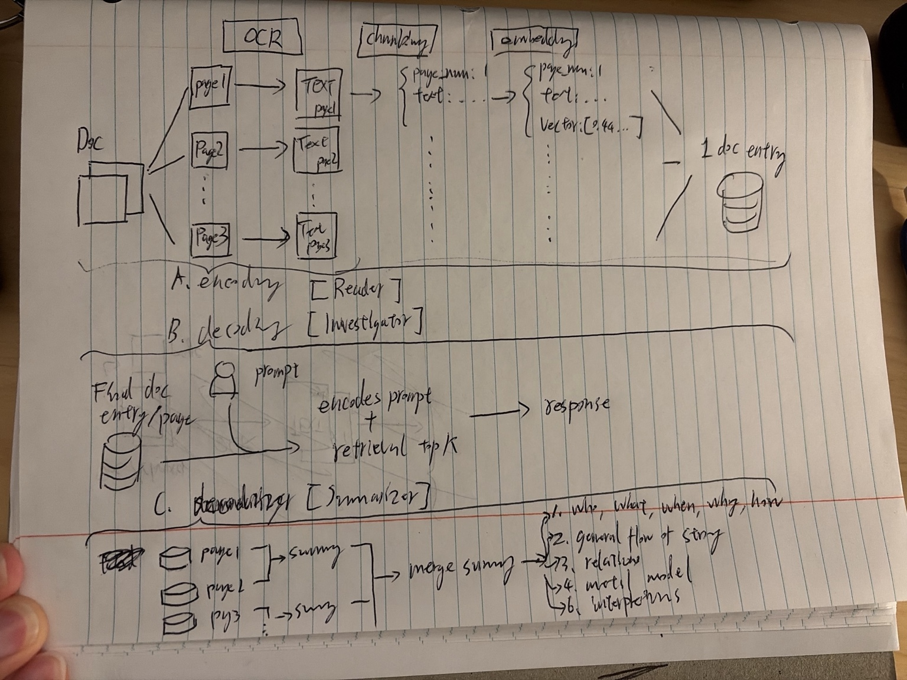

# reading app

Local, page-grounded reading app for PDFs and course materials.

## What this project is

A Pi-friendly tool with 3 parts:

1. **Standalone OCR + indexing pipeline**
   - PDF -> page OCR -> page text -> chunking -> embeddings -> local vector index
   - One document/page entry per page
   - Everything stays local

2. **Investigator / retrieval tool**
   - A subagent can refine the user prompt into a search query
   - The investigator uses top-k retrieval over the index
   - Returns relevant page-grounded answers
   - Example: “who is Jack’s mom?”

3. **Summarizer / document understanding tool**
   - Separate command that reads `pages.json`
   - Summaries are made in configurable page windows (default: 10 pages), then merged into a larger summary
   - Uses OCR content as grounding only; no guessing, no hallucination
   - Good for:
     - who / what / when / why / how
     - concise story flow without losing useful details
     - relations between subjects and characters
     - environments, objects, and what they symbolize
     - mental model
     - objective interpretation

## Architecture



## Workflow

### 1) OCR + indexing
- Render PDF pages locally with PyMuPDF.
- OCR each page separately with PaddleOCR when needed.
- Keep page text, OCR confidence, and source metadata.
- Chunk from page documents, not from one big chapter blob.
- Preserve page number metadata in every node.
- Persist the index locally per reading.

### 2) Investigator / retrieval
- User asks a question.
- A subagent may rewrite or refine it.
- The investigator tool encodes the query and retrieves top-k relevant chunks.
- The final answer is grounded in retrieved pages only.
- Output format is always:
  - `Question`
  - `Response`
  - `Evidence`
- Include page-number citations.
- Say when evidence is insufficient.

### 3) Summarizer / story understanding
- Separate command that reads `pages.json`.
- Split the document into configurable page windows (default: 10 pages).
- Summarize each window with a lightweight LLM.
- Merge all window summaries into one document-level summary.
- Save summary artifacts under `summaries/`.
- Use the merged summary to answer broad “story understanding” questions.
- Ground every claim in OCR/page content.

## What this app uses

- Python
- PyMuPDF for PDF rendering
- PaddleOCR for OCR on scanned pages
- LlamaIndex for document indexing and retrieval
- Ollama or an API LLM for summarization when available
- JSON files for local persistence

## Input

- One PDF at a time.
- The app preserves page boundaries and page numbers.
- Each reading gets its own local folder under `data/ocr/<pdf-stem>/` by default.

## How to run

Put a PDF in `data/raw/`, then run:

```bash
python ingest.py --file "Homer Iliad Book 1.pdf" --reading-id iliad_book1 --title "Homer Iliad Book 1" --author Homer --renderer pymupdf --dpi 120
```

Then summarize separately:

```bash
python main.py summarize --reading-id iliad_book1 --llm-model qwen2.5-deterministic
```

Build study materials:

```bash
python main.py study --reading-id iliad_book1
```

Then ask questions:

```bash
python main.py ask --reading-id iliad_book1 --question "Who is Achilles arguing with?"
```

Pi integration lives in:

```text
.pi/
  extensions/literature.ts
  agents/literature-investigator.md
  agents/literature-assistant.md
```

You can also use a full path instead of a filename. If the file name is found in `data/raw/`, the app will use that automatically.

## Current project layout

```text
data/
  raw/
    Homer Iliad Book 1.pdf
  ocr/
    Homer Iliad Book 1/
      metadata.json
      pages.json
      source.pdf
      index/
      summaries/
        window_summaries.json
        summary.json
        summary.md
        study_materials.md
.pi/
  extensions/
    literature.ts
  agents/
    literature-investigator.md
    literature-assistant.md
public/
  idea.jpeg
```

## Current status

Implemented:
- OCR page extraction
- Local persistence of page text and metadata
- LlamaIndex ingestion and index persistence
- Separate summarization command + artifacts (`summaries/`)
- Retrieval/Q&A command with citations
- Pi extension + two literature subagents
- Smoke test on `Homer Iliad Book 1.pdf`
- Local architecture sketch in `public/idea.jpeg`

Next:
- Citation verifier

## Plan

See [`PLAN.md`](PLAN.md) for the detailed implementation plan and the intended later execution order.
